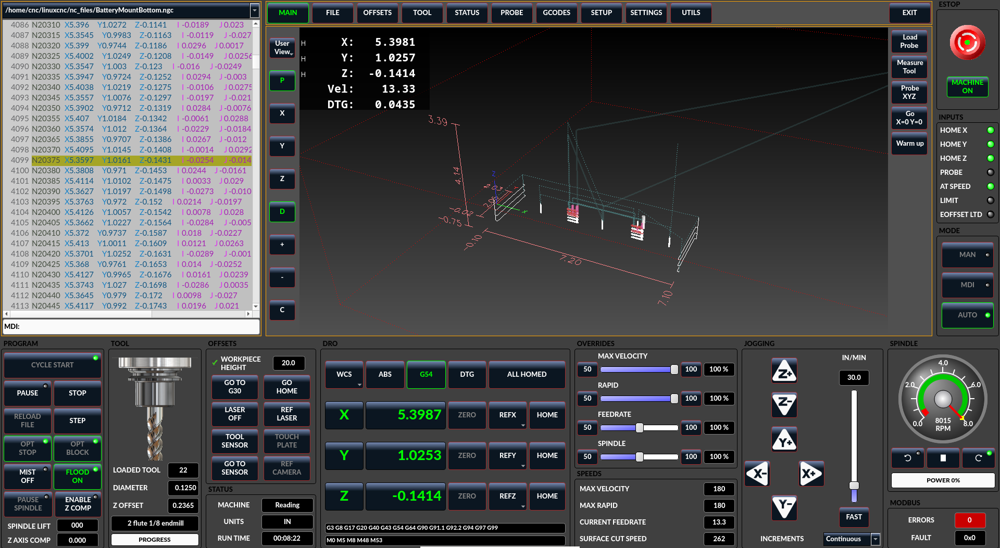
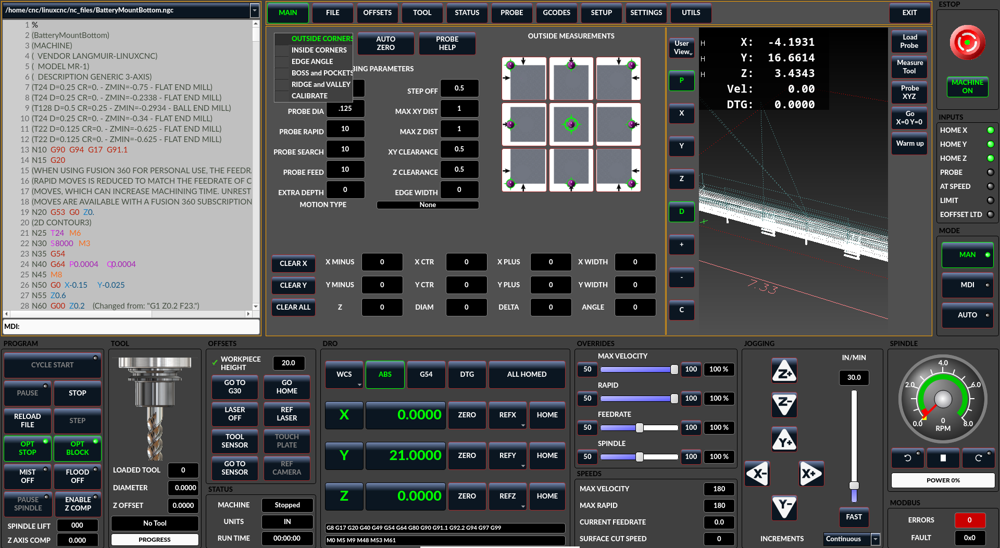
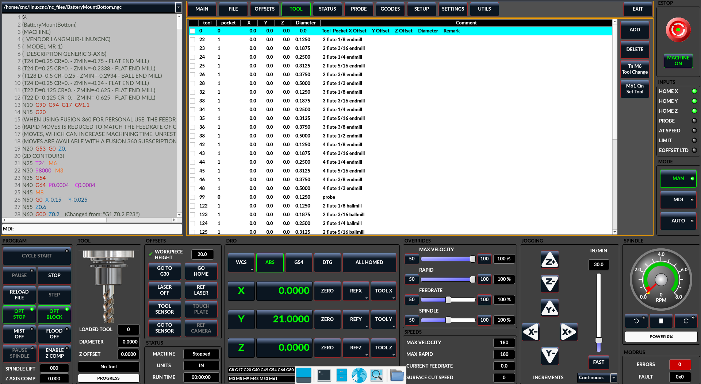
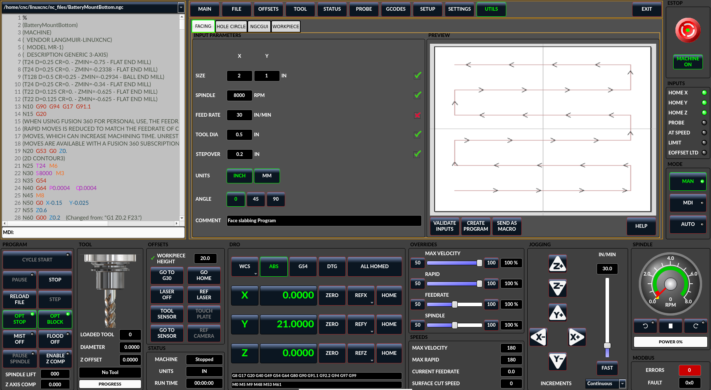

# Langmuir MR-1 configuration for LinuxCNC

My LinuxCNC configuration for the Langmuir MR-1 gantry mill.

WARNING: This is a work in progress and has only been lightly tested by my own use.  It works for me, but I can't
make any promisses about the suitability of this configuration and code to operate your machine.

There are two branches here.  The "main" branch has the last working version of this with the stock MR-1 spindle.  It can be
viewed at https://github.com/alexphredorg/mr1/tree/main. There is also a new branch for the CNCDepot FM30F spindle which can 
be viewed at https://github.com/alexphredorg/mr1/tree/fm30f.

Notes on the configuration:
* I'm using the stock spindle (servo) drive, stepper motors and tool probes.  I've upgraded my stepper drives to Leadshine 
EM542S, but the configuration here is compatible with the stock steppers as long as you slow down the max velocities.
* My machine is connected to the PC running LinuxCNC using a MESA 7i96S and ethernet on a private network.
* Tool changes use probing to set the tool height.  This uses the Langmuir probe and tool setter.  The probe is tool 99 and
tool length probing is automatic for all tools other than 0 and 99.  When the probe is unloaded it is always measured.

LinuxCNC on Debian 12 installation steps:
* This install guide will get Debian 12 + LinuxCNC together and includes useful tips and tricks: https://docs.google.com/document/d/1jeV_4VKzVmOIzbB-ytcgsW2I_PhCm1x7oiw8VcLFdiY/edit
* mkdir ~/linuxcnc/configs
* git clone https://github.com/alexphredorg/mr1.git
* Check mr1.ini 
* Start LinuxCNC and select mr1/mr1

Consider pulling the latest LinuxCNC drops from http://buildbot2.highlab.com/debian/dists/bookworm/2.9-uspace/

I'm using LinuxCNC's qtDragon as my core user interface.  It had the right mix of a clean and easy to use design with the 
functionality that I wanted including good probe screens.  I made some changes to qtDragon made some minor changes to it to 
better support stock MR-1 hardware.  

With this system I get quicker manual tool changes.  A tool change command in G-Code (Tnn M6) will stop the spindle and 
coolant, bring the spindle to the front and center and wait for the operator to change the tool.  Once changed they click
OK on the screen and the tool is automatically measured for length and the program continues.

## Screenshots

## Wiring Table
This table contains details on how the MESA 7i96S is wired to the rest of the machine.

| MESA 7i96S |     |              |        | Langmuir MR-1       |         |                         |               |
|------------|-----|--------------|--------|---------------------|---------|-------------------------|---------------|
| Connector  | Pin | Signal       | Jumper | Device              | Pin     | Notes                   | Wire Color    |
| P4         | 1   | 5 Volts      |        |                     |         | From 5V PSU             |               |
|            | 2   | Ground       |        |                     |         | From 5V PSU             |               |
| TB1-X      | 1   | GND          |        |  All stepper drives | ENA-    | Enable- circuit         |  Black        |
|            | 2   | STEP0-       |        | X stepper           | PUL-    |                         | Blue          |
|            | 3   | STEP0+       |        | X stepper           | PUL+    |                         | Blue/White    |
|            | 4   | DIR0-        |        | X stepper           | DIR-    |                         | Green         |
|            | 5   | DIR0+        |        | X stepper           | DIR+    |                         | Green/White   |
|            | 6   | 5VP          |        | Limit Switches      | 5V      | 5V to limit switch port | Red           |
| TB1-Y1     | 7   | GND          |        |                     |         |                         |               |
|            | 8   | STEP1-       |        | Y1 stepper          | PUL-    |                         | Brown         |
|            | 9   | STEP1+       |        | Y1 stepper          | PUL+    |                         | Brown/White   |
|            | 10  | DIR1-        |        | Y1 stepper          | DIR-    |                         | Orange        |
|            | 11  | DIR1+        |        | Y1 stepper          | DIR+    |                         | Orange/White  |
|            | 12  | 5VP          |        | E-Stop Loop         | 5V      |                         |               |
| TB1-Y2     | 13  | GND          | TB3-12 |                     |         | Input ground            | White         |
|            | 14  | STEP2-       |        | Y2 stepper          | PUL-    |                         | Blue          |
|            | 15  | STEP2+       |        | Y2 stepper          | PUL+    |                         | Blue/White    |
|            | 16  | DIR2-        |        | Y2 stepper          | DIR-    |                         | Green         |
|            | 17  | DIR2+        |        | Y2 stepper          | DIR+    |                         | Green/White   |
|            | 18  | 5VP          |        | Probes 5V           | 5V      | 5V to probes            | Red           |
| TB1-Z      | 19  | GND          |        |                     |         |                         |               |
|            | 20  | STEP3-       |        | Z stepper           | PUL-    |                         | Brown         |
|            | 21  | STEP3+       |        | Z stepper           | PUL+    |                         | Brown/White   |
|            | 22  | DIR3-        |        | Z stepper           | DIR-    |                         | Orange        |
|            | 23  | DIR3+        |        | Z stepper           | DIR+    |                         | Orange/White  |
|            | 24  | 5VP          | TB3-14 | Coolant Relay 5V    | 5V      | Coolant Relay Output 5V |               |
| TB2-A      | 1   | GND          |        | Probes Ground       |         | Ground to probes        | White         |
|            | 2   | STEP4-       |        | future A            |         |                         |               |
|            | 3   | STEP4+       |        | future A            |         |                         |               |
|            | 4   | DIR4-        |        | future A            |         |                         |               |
|            | 5   | DIR4+        |        | future A            |         |                         |               |
|            | 6   | 5VP          |        |                     |         |                         |               |
| TB2-EN     | 7   | ENCA+        |        | Spindle Encoder     | DB44-13 | Encoder                 | Blue/White    |
|            | 8   | ENCA-        |        | Spindle Encoder     | DB44-28 | Encoder                 | Blue          |
|            | 9   | GND          |        | Spindle Encoder     |         |                         |               |
|            | 10  | ENCB+        |        | Spindle Encoder     | DB44-14 | Encoder                 | Green/White   |
|            | 11  | ENCB-        |        | Spindle Encoder     | DB44-29 | Encoder                 | Green         |
|            | 12  | 5VP          |        | Spindle Encoder     |         |                         |               |
|            | 13  | IDX+         |        | Spindle Encoder     | DB44-15 | Encoder                 | Orange/White  |
|            | 14  | IDX-         |        | Spindle Encoder     | DB44-30 | Encoder                 | Orange        |
| TB2-RS     | 15  | GND          | TB2-22 | Spindle Encoder     |         |                         | Black         |
|            | 16  | RS422 RX+    |        | I/O daughter board  |         |                         |               |
|            | 17  | RS422 RX-    |        | I/O daughter board  |         |                         |               |
|            | 18  | RS422 TX+    |        | I/O daughter board  |         |                         |               |
|            | 19  | RS422 TX-    |        | I/O daughter board  |         |                         |               |
|            | 20  | 5VP          | TB2-24 |                     |         | Connect to TB2-24       | Red           |
| TB2-SP     | 21  | NC           |        |                     |         |                         |               |
|            | 22  | SPINDLE-     | TB2-15 | Spindle             | DB44-10 | Analog Speed - (Ground) | Brown         |
|            | 23  | SPINDLE OUT  |        | Spindle             | DB44-26 | Analog Speed + (PWM)    | Brown/White   |
|            | 24  | SPINDLE+     | TB2-20 | Spindle             | 5V      | 5V                      | Red           |
| TB3-I1     | 1   | INPUT0       |        | E-stop              |         | NC                      |               |
|            | 2   | INPUT1       |        | X limit             |         | NC, use inv             | blue          |
|            | 3   | INPUT2       |        | Y1 limit            |         | NC, use inv             | yellow        |
|            | 4   | INPUT3       |        | Y2/Z limit          |         | NC, use inv             | purple        |
|            | 5   | INPUT4       |        |                     |         |                         |               |
|            | 6   | INPUT5       |        |                     |         |                         |               |
|            | 7   | INPUT6       |        | Tool setter         |         |                         | orange        |
|            | 8   | INPUT7       |        | Probe               |         |                         | blue          |
|            | 9   | INPUT8       |        |                     |         |                         |               |
|            | 10  | INPUT9       |        |                     |         |                         |               |
|            | 11  | INPUT10      |        | Spindle Alarm       | DB44-5  | maybe later?            |               |
|            | 12  | INPUT Common |        |                     | GND     |                         |               |
|            | 13  | OUT0-        |        | All Stepper Drives  | ENA+    | Stepper enable          | Light purple  |
|            | 14  | OUT0+        |        | 5V                  |         |                         | Red           |
|            | 15  | OUT1-        |        |                     |         |                         |               |
|            | 16  | OUT1+        |        |                     |         |                         |               |
|            | 17  | OUT2-        |        |                     |         |                         |               |
|            | 18  | OUT2+        |        |                     |         |                         |               |
|            | 19  | OUT3-        |        |                     |         |                         |               |
|            | 20  | OUT3+        |        |                     |         |                         |               |
|            | 21  | OUT4A        |        |  Coolant Relay      |         |                         |               |
|            | 22  | OUT4B        |        |  5V (Coolant Relay) |         |                         |               |
|            | 23  | OUT5A        |        | Spindle Enable      | DB44-16 |                         | lavender      |
|            | 24  | OUT5B        |        | Ground              | GND     | from 24V PSU            | black         |

## Wiring Notes
DC coloring:
* Langmuir uses white for DC-, black for DC+ (yes, very confusing!)

Power supply needs:
* 36V for stepper drives (or 48V if you replace the stepper drives)
* 24V for spindle servo inputs
* 5V for Mesa 7i96s and inputs/outputs

Probe/Tool Setter warning:
* These expose 5V DC on all external metal surfaces
* Make sure to isolate DC ground from AC spindle ground
* Disconnect DB44-11 and DB44-12 so that they float
* Langmuir did the same (if you take apart your DB44 cable you'll see that pin 12 was initially connected and then snipped)
* Probe pinout: 1=white, 2=black, 3=red

Inputs:
* Active high type (PNP)
* Probes: Require 5V and GND (for LEDs/internal electronics)
* Limit and e-stop switches are NC 5V 

Outputs:
* Spindle Enable: 24V active low (NPN) 
* Coolant: 5V active low

Spindle pins:
* DB44-13, DB44-28: Encoder A phase
*  DB44-14, DB44-29: Encoder B phase
*  DB44-15, DB44-30: Encoder Z phase
*  DB44-30: Encoder ground (must be connected)
*  DB44-10, DB44-11: Spindle speed ground
*  DB44-26: Spindle Speed analog (0-5V)
*  DB44-16: Spindle Enable
*  DB44-31: 24V PSU +
*  DB44-23: 24V PSU-

## Useful Documentation Links
* Spindle servo drive: http://data.sah.rs/products/motor-control/servo/manuals/T3a_T3L_manual.pdf
* Mesa 7i96S: http://www.mesanet.com/pdf/parallel/7i96sman.pdf
* Small Steppers Drives (TB6600): https://dfimg.dfrobot.com/nobody/wiki/0bcc0b661ce7750ff7d0134bfc3e88b3.pdf and https://forum.linuxcnc.org/16-stepconf-wizard/28553-configuring-tb6600 (85mm mounting distance)
* Large Stepper Drives (CWD860H): https://cdn.shopify.com/s/files/1/0568/0988/1690/files/CWD860H.pdf (148mm mounting distance)
* Upgrade Stepper Drives (Leadshine EM542S): https://www.leadshine.com/product-detail/stepper-drive/stepper/EM542S.html (112mm mounting distance)

## Drive Constants
| Axis | Pitch | Steps per Rev | Steps per Inch |
|------|-------|---------------|----------------|
| X    | 5mm   | 1600          | 8128           |
| Y    | 5mm   | 1600          | 8128           |
| Z    | 3mm   | 1600          | 13547          |
| Spin | N/A   | 5000          | N/A            |

* Stock stepper timing: 5000us step, 20000us dir  
* EM542S stepper timing: 3000us step, 10000us dir  
* EM542S stepper configuration: SW1-3: ON-OFF-OFF (3.8A); SW4: OFF; SW5-8: OFF-OFF-ON-ON (1600); SW9-10: ON-ON; SW11: OFF, SW12: OFF; SW13: OFF; SW14: OFF; SW15: OFF; SW16: OFF  

## OneNote

My original OneNote from the conversion can be found here: https://1drv.ms/u/s!AqokoOqNPTKZkpR0nkyh90eFzuL-rw  

I've moved useful content into this README.

